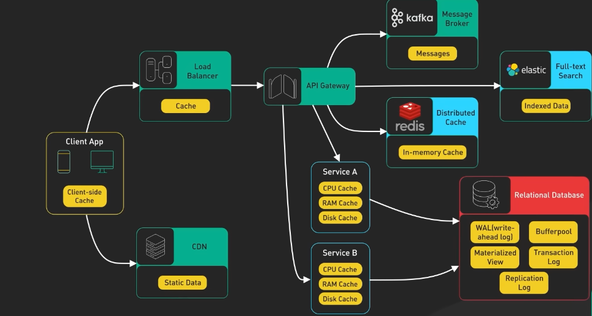

## Caching
Common technique to enhance system perfomance and reduce response time.

A typical system involves different caching layers. For example:

Image credit: _ByteByteGo_ on youtube

## Caching Layers
- L1 Cache (CPU Cache)
  - Smallest and fastest cache located closest to the CPU cores.
  - Typically divided into L1d (data) and L1i (instruction) caches.

- L2 Cache
  - Larger than L1 but slower, still located on the CPU chip.

- L3 Cache
  - Shared among multiple CPU cores, larger and slower than L2.

- Translation Lookaside Buffer (TLB)
  - A specialized cache that stores recent translations of virtual memory to physical memory addresses.

- Page Cache
  - Caches frequently accessed disk pages in RAM to reduce disk I/O.

- Inode Cache
  - Caches metadata about files and directories to speed up file system operations.